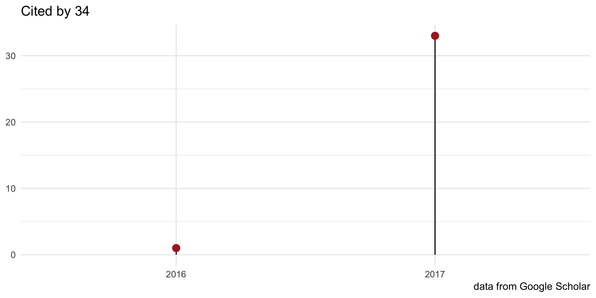
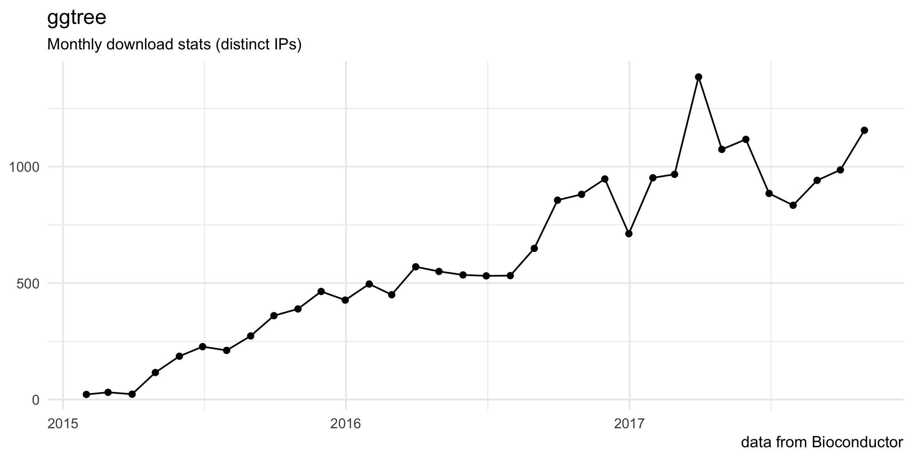

<!-- README.md is generated from README.Rmd. Please edit that file -->
ggtree: an R package for visualization and annotation of phylogenetic trees with their covariates and other associated data
===========================================================================================================================

The `ggtree` package extending the `ggplot2` package. It based on
grammar of graphics and takes all the good parts of `ggplot2`. `ggtree`
is designed for not only viewing phylogenetic tree but also displaying
annotation data on the tree.

For details, please visit our project website,
<https://guangchuangyu.github.io/ggtree>.

-   [Documentation](https://guangchuangyu.github.io/ggtree/documentation/)
-   [FAQ](https://guangchuangyu.github.io/ggtree/faq/)
-   [Featured
    Articles](https://guangchuangyu.github.io/ggtree/featuredArticles/)
-   [Feedback](https://guangchuangyu.github.io/ggtree/#feedback)

------------------------------------------------------------------------

Please cite the following article when using `ggtree`:

**G Yu**, DK Smith, H Zhu, Y Guan, TTY Lam\*. ggtree: an R
package for visualization and annotation of phylogenetic trees with
their covariates and other associated data. ***Methods in Ecology and
Evolution***. 2017, 8(1):28-36.

------------------------------------------------------------------------

### Citation

### Download stats

Contributors
------------

This project exists thanks to all the people who contribute.
[\[Contribute\]](CONTRIBUTING.md).

Backers
-------

Thank you to all our backers! 🙏 \[[Become a
backer](https://opencollective.com/ggtree#backer)\]

Sponsors
--------

Support this project by becoming a sponsor. Your logo will show up here
with a link to your website. \[[Become a
sponsor](https://opencollective.com/ggtree#sponsor)\]

