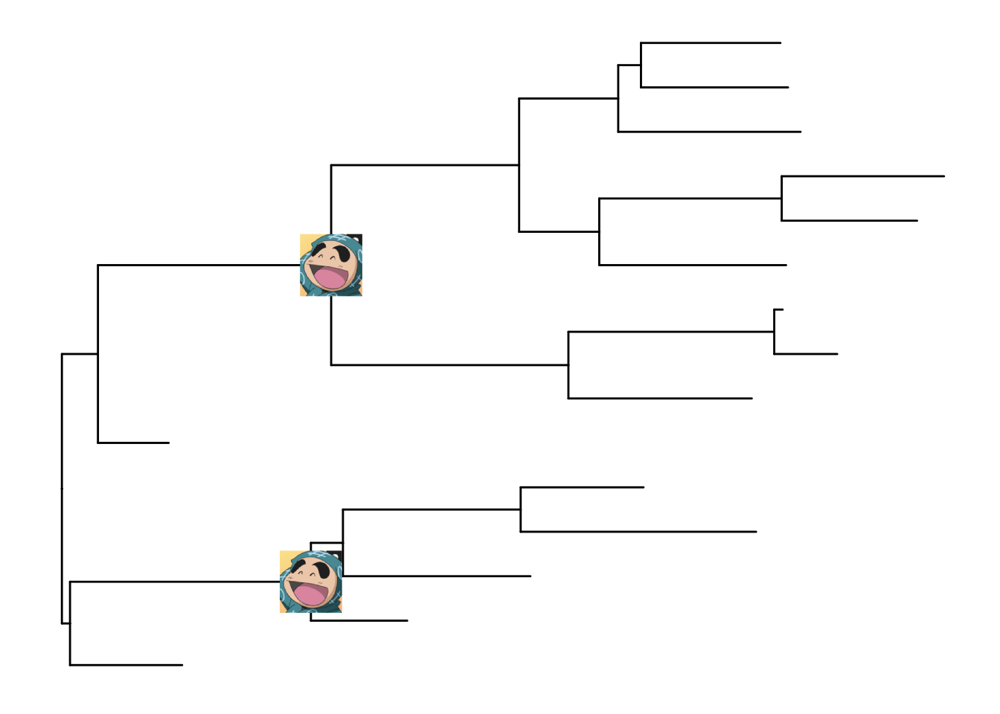
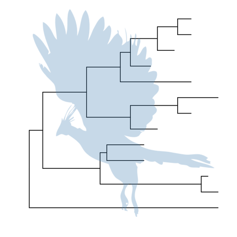

```{r style, echo=FALSE, results="asis", message=FALSE}
knitr::opts_chunk$set(tidy = FALSE,
		   message = FALSE)
```


```{r echo=FALSE, results="hide", message=FALSE}
library("ape")
library("ggplot2")
library("ggtree")
```


# Visualize tree with associated matrix

<!--
At first we implemented `gplot` function to visualize tree with heatmap but it has [an issue](https://github.com/GuangchuangYu/ggtree/issues/3) that it can't always guarantee the heatmap aligning to the tree properly, since the line up is between two figures and it's currently not supported internally by ggplot2. I have implemented another function `gheatmap` that can do the line up properly by creating a new layer above the tree.
-->

The `gheatmap` function is designed to visualize phylogenetic tree with heatmap of associated matrix.

In the following example, we visualized a tree of H3 influenza viruses with their associated genotype.

```{r fig.width=20, fig.height=16, fig.align="center"}
beast_file <- system.file("examples/MCC_FluA_H3.tree", package="ggtree")
beast_tree <- read.beast(beast_file)

genotype_file <- system.file("examples/Genotype.txt", package="ggtree")
genotype <- read.table(genotype_file, sep="\t", stringsAsFactor=F)
p <- ggtree(beast_tree, mrsd="2013-01-01") + geom_treescale(x=2008, y=1)
p <- p + geom_tiplab(size=3)
gheatmap(p, genotype, offset = 2, width=0.5)
```

The _width_ parameter is to control the width of the heatmap. It supports another parameter _offset_ for controlling the distance between the tree and the heatmap, for instance to allocate space for tip labels.


For time-scaled tree, as in this example, it's more often to use x axis by using `theme_tree2`. But with this solution, the heatmap is just another layer and will change the `x` axis. To overcome this issue, we implemented `scale_x_ggtree` to set the x axis more reasonable. 

<!-- User can also use `gplot` and tweak the positions of two plot to align properly. -->

```{r fig.width=20, fig.height=16, fig.align="center", warning=FALSE}
p <- ggtree(beast_tree, mrsd="2013-01-01") + geom_tiplab(size=3, align=TRUE) + theme_tree2()
pp <- (p + scale_y_continuous(expand=c(0, 0.3))) %>%
    gheatmap(genotype, offset=4, width=0.5, colnames=FALSE) %>%
        scale_x_ggtree()
pp + theme(legend.position="right")
```

# Visualize tree with multiple sequence alignment

With `msaplot` function, user can visualize multiple sequence alignment with phylogenetic tree, as demonstrated below:
```{r fig.width=8, fig.height=12, fig.align='center'}
fasta <- system.file("examples/FluA_H3_AA.fas", package="ggtree")
msaplot(ggtree(beast_tree), fasta) 
```

A specific slice of the alignment can also be displayed by specific _window_ parameter.

```{r fig.width=16, fig.height=16, fig.align='center'}
msaplot(ggtree(beast_tree), fasta, window=c(150, 200)) + coord_polar(theta='y')
```

# Annotate a phylogenetic tree with insets

`ggtree` provides a function, `inset`, for adding subplots to a phylogenetic tree. The input is a tree graphic object and a named list of ggplot graphic objects (can be any kind of charts), these objects should named by node numbers. To facilitate adding bar and pie charts (e.g. summarized stats of results from ancestral reconstruction) to phylogenetic tree, *ggtree* provides `nodepie` and `nodebar` functions to create a list of pie or bar charts.

## Annotate with bar charts

```{r}
set.seed(2015-12-31)
tr <- rtree(15)
p <- ggtree(tr)

a <- runif(14, 0, 0.33)
b <- runif(14, 0, 0.33)
c <- runif(14, 0, 0.33)
d <- 1 - a - b - c
dat <- data.frame(a=a, b=b, c=c, d=d)
## input data should have a column of `node` that store the node number
dat$node <- 15+1:14

## cols parameter indicate which columns store stats (a, b, c and d in this example)
bars <- nodebar(dat, cols=1:4)

inset(p, bars)
```

The sizes of the insets can be ajusted by the paramter *width* and *height*.

```{r}
inset(p, bars, width=.03, height=.06)
```

Users can set the color via the parameter *color*. The *x* position can be one of 'node' or 'branch' and can be adjusted by the parameter *hjust* and *vjust* for horizontal and vertical adjustment respecitvely.


```{r}
bars2 <- nodebar(dat, cols=1:4, position='dodge',
                 color=c(a='blue', b='red', c='green', d='cyan'))
p2 <- inset(p, bars2, x='branch', width=.03, vjust=-.3)
print(p2)
```

## Annotate with pie charts

Similarly, users can use `nodepie` function to generate a list of pie charts and place these charts to annotate corresponding nodes. Both `nodebar` and `nodepie` accepts parameter *alpha* to allow transparency.

```{r}
pies <- nodepie(dat, cols=1:4, alpha=.6)
inset(p, pies)
```


```{r}
inset(p, pies, hjust=-.06)
```

## Annotate with other types of charts

The `inset` function accepts a list of ggplot graphic objects and these input objects are not restricted to pie or bar charts. They can be any kinds of charts and hybrid of these charts.

```{r}
pies_and_bars <- bars2
pies_and_bars[9:14] <- pies[9:14]
inset(p, pies_and_bars)
```

```{r}
d <- lapply(1:15, rnorm, n=100)
ylim <- range(unlist(d))
bx <- lapply(d, function(y) {
    dd <- data.frame(y=y)
    ggplot(dd, aes(x=1, y=y))+geom_boxplot() + ylim(ylim) + theme_inset()
})
names(bx) <- 1:15
inset(p, bx, width=.03, height=.1, hjust=-.05)
```


After annotating with insets, users can further annotate the tree with another layer of insets.

```{r fig.width=10, fig.height=7}
p2 <- inset(p, bars2, x='branch', width=.03, vjust=-.4)
p2 <- inset(p2, pies, x='branch', vjust=.4)
bx2 <- lapply(bx, function(g) g+coord_flip())
inset(p2, bx2, width=.2, height=.03, vjust=.04, hjust=p2$data$x[1:15]-4) + xlim(NA, 4.5)
```

## Annotate with image files

```{r eval=FALSE}
imgfile <- tempfile(, fileext=".png")
download.file("https://avatars1.githubusercontent.com/u/626539?v=3&u=e731426406dd3f45a73d96dd604bc45ae2e7c36f&s=140", destfile=imgfile, mode='wb')
img <- list(imgfile, imgfile)
names(img) <- c("18", "22")
inset(p, img)
```



# Align tree with other plots on a page

This is currently difficult to achieve in `ggplot2`. However, it is possible to obtain good results by creating a dummy faceting of data.

```{r warning=F, fig.width=10, fig.height=6}
tr <- rtree(30)
df <- fortify(tr)
df$tipstats <- NA
d1 <- df
d2 <- df
d2$tipstats[d2$isTip] <- abs(rnorm(30))
d1$panel <- 'Tree'
d2$panel <- 'Stats'
d1$panel <- factor(d1$panel, levels=c("Tree", "Stats"))
d2$panel <- factor(d2$panel, levels=c("Tree", "Stats"))

p <- ggplot(mapping=aes(x=x, y=y)) + facet_grid(.~panel, scale="free_x") + theme_tree2()
p+geom_tree(data=d1) + geom_point(data=d2, aes(x=tipstats)) 
```

# Tree annotation with Phylopic


[PhyloPic](http://phylopic.org/) is a database that stores reusable silhouette images of organisms. `ggtree` supports downloading images from [PhyloPic](http://phylopic.org/) and annotating phylogenetic tree with the downloaded images.

```{r fig.width=5, fig.height=5, fig.align="center", warning=FALSE, eval=FALSE}
pp <- ggtree(tree) %>% phylopic("79ad5f09-cf21-4c89-8e7d-0c82a00ce728", color="steelblue", alpha = .3)
print(pp)
```


```{r fig.width=5, fig.height=5, fig.align="center", warning=FALSE, eval=FALSE}
pp %>% phylopic("67382184-5135-4faa-8e98-eadff02c3e8a", color="#86B875", alpha=.8, node=4) %>%
     phylopic("d3563b54-780f-4711-a49a-7ea051e9dacc", color="darkcyan", alpha=.8, node=17, width=.2)
```


