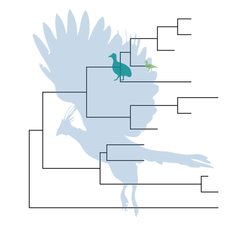

```{r style, echo=FALSE, results="asis", message=FALSE}
BiocStyle::markdown()
knitr::opts_chunk$set(tidy = FALSE,
		   message = FALSE)
```


```{r echo=FALSE, results="hide", message=FALSE}
library("colorspace")
library("Biostrings")
library("ape")
library("ggplot2")
library("gridExtra")
library("ggtree")
```


> You can't even begin to understand biology, you can't understand life, unless you understand what it's all there for, how it arose - and that means evolution.
> --- Richard Dawkins


# Citation
If you use `r Biocpkg("ggtree")` in published research, please cite:

```
G Yu, D Smith, H Zhu, Y Guan, TTY Lam,
ggtree: an R package for visualization and annotation of phylogenetic tree with different types of meta-data.
submitted.
```

# Introduction
This project arose from our needs to annotate nucleotide substitutions in the phylogenetic tree, and we found that there is no tree visualization software can do this easily. Existing tree viewers are designed for displaying phylogenetic tree, but not annotating it. Although some tree viewers can displaying bootstrap values in the tree, it is hard/impossible to display other information in the tree. Our first solution for displaying nucleotide substituitions in the tree is to add this information in the node/tip names and use traditional tree viewer to show it. We displayed the information in the tree successfully, but We believe this indirect approach is inefficient.

In the old day, phylogenetic tree is often small. At that time, as we almost didn't have a need to annotate a tree; displaying the evolution relationships is mostly enough. Nowadays, we can obtain a lot of data from different experiments, and we want to associate our data, for instance antigenic change, with the evolution relationship. Visualizing these associations in the phylogenetic tree can help us to identify evolution patterns. We believe we need a next generation tree viewer that should be programmable and extensible. It can view a phylogenetic tree easily as we did with classical software and support adding annotation data in a layer above the tree. This is the objective of developing the `r Githubpkg("GuangchuangYu/ggtree")`. Common tasks of annotating a phylogenetic tree should be easy and complicated tasks can be possible to achieve by adding multiple layers of annotation.

The `r Githubpkg("GuangchuangYu/ggtree")` is designed by extending the `r CRANpkg("ggplot2")`[@wickham_ggplot2_2009] package. It is based on the grammar of graphics and takes all the good parts of `r CRANpkg("ggplot2")`. There are other R packages that implement tree viewer using `r CRANpkg("ggplot2")`, including `r CRANpkg("OutbreakTools")`, `r Biocpkg("phyloseq")`[@mcmurdie_phyloseq_2013] and `r Githubpkg("gjuggler/ggphylo")`; they mostly create complex tree view functions for their specific needs. Internally, these packages interpret a phylogenetic as a collection of `lines`, which makes it hard to annotate diverse user input that are related to node (taxa). The `r Githubpkg("GuangchuangYu/ggtree")` is different to them by interpreting a tree as a collection of `taxa` and allowing general flexibilities of annotating phylogenetic tree with diverse types of user inputs. 

# Tree visualization
## viewing tree with `ggtree`
`r Githubpkg("GuangchuangYu/ggtree")` extend _`ggplot`_ to support viewing phylogenetic tree. It implements _`geom_tree`_ layer for displaying phylogenetic trees, as shown below:
```{r fig.width=3, fig.height=3, fig.align="center"}
nwk <- system.file("extdata", "sample.nwk", package="ggtree")
x <- readLines(nwk)
cat(substring(x, 1, 56), "\n", substring(x, 57), "\n")

library("ggplot2")
library("ggtree")

tree <- read.tree(nwk)
ggplot(tree, aes(x, y)) + geom_tree() + theme_tree() + xlab("") + ylab("")
```

This example tree was obtained from Chapter 34 of _Inferring Phylogenies_[@felsenstein_inferring_2003 pp.573]. The function, _`ggtree`_, was implemented as a short cut to visualize a tree, and it works exactly the same as shown above.

_`ggtree`_ takes all the advantages of _`ggplot2`_. For example, we can change the color, size and type of the lines as we do with _`ggplot2`_.
```{r fig.width=3, fig.height=3, fig.align="center"}
ggtree(tree, color="steelblue", size=0.5, linetype="dotted")
```

By default, the tree is viewing in ladderize form, user can set the parameter _`ladderize = FALSE`_ to disable it.
```{r fig.width=3, fig.height=3, fig.align="center"}
ggtree(tree, ladderize=FALSE)
```

The _`branch.length`_ is used to scale the edge, user can set the parameter _`branch.length = "none"`_ to only viewing the tree topology (cladogram) or other numerical variable to scale the tree (e.g. dN/dS).

```{r fig.width=3, fig.height=3, fig.align="center"}
ggtree(tree, branch.length="none")
```

## support multiple phylogenetic classes

`r Githubpkg("GuangchuangYu/ggtree")` defined several S4 classes to store phylogenetic object and its associated annotation, including:

+ `beast`
+ `codeml_mlc`
+ `codeml`
+ `hyphy`
+ `jplace`
+ `paml_rst`
+ `raxml`
+ `r8s`


In addition, it also supports _`phylo`_ (defined by `r CRANpkg("ape")`[@paradis_ape_2004]), and _`phylo4`_ (defined by `r CRANpkg("phylobase")`)

User can use _`ggtree(object)`_ command to view the phylogenetic tree directly, and annotation data stored in these objects can be added as demonstrated in __[`Tree annotation with output from evolution software`](#tree-annotation-with-output-from-evolution-software)__ session.


## layout

Currently, _`ggtree`_ supports several layout, including:

+ `rectangular` (by default)
+ `slanted`
+ `fan` or `circular`

for `Phylogram` (by default) and `Cladogram` if user explicitly setting `branch.length='none'`.

And `unrooted` layout. 

Unrooted layout was implemented by the _`equal-angle algorithm`_ that described in _Inferring Phylogenies_[@felsenstein_inferring_2003 pp.578-580].

```{r fig.width=6, fig.height=9, fig.align="center"}
library("gridExtra")
grid.arrange(ggtree(tree) + ggtitle("(Phylogram) rectangular layout"),
             ggtree(tree, branch.length='none') + ggtitle("(Cladogram) rectangular layout"),
	     ggtree(tree, layout="slanted") + ggtitle("(Phylogram) slanted layout"),
             ggtree(tree, layout="slanted", branch.length='none') + ggtitle("(Cladogram) slanted layout"),
	     ggtree(tree, layout="circular") + ggtitle("(Phylogram) circular layout"),
             ggtree(tree, layout="circular", branch.length="none") + ggtitle("(Cladogram) circular layout"),
	     ggtree(tree, layout="unrooted") + ggtitle("unrooted layout"),
	     ncol=2)
```	

### two dimensional tree

`r Githubpkg("GuangchuangYu/ggtree")` implemented 2 dimensional tree. It accepts parameter _`yscale`_ to scale the y-axis based on the selected tree attribute. The attribute should be numerical variable. If it is character/category variable, user should provides a name vector of mapping the variable to numeric by passing it to parameter _`yscale_mapping`_.


```{r fig.width=9, fig.height=4, fig.align="center"}
tree2d <- read.beast(system.file("extdata", "twoD.tree", package="ggtree"))
ggtree(tree2d, mrsd = "2014-05-01",
       yscale="NGS", yscale_mapping=c(N2=2, N3=3, N4=4, N5=5, N6=6, N7=7)) +
           theme_classic() + 
               theme(panel.grid.major=element_line(color="grey20", linetype="dotted", size=.3),
                     panel.grid.major.y=element_blank()) +
                         scale_y_continuous(labels=paste0("N", 2:7))
```	

In this example, the figure demonstrates the quantity of y increase along the trunk. User can highlight the trunk with different line size or color using the functions we described below.


## display evolution distance

To show evolution distance, user can use `add_legend` function.

```{r fig.width=3, fig.height=3, fig.align="center"}
ggtree(tree) %>% add_legend()
```

We can also use `theme_tree2()` or `ggtree(showDistance=TRUE)`

```{r fig.width=3, fig.height=3, fig.align="center"}
ggtree(tree) + theme_tree2()
```

## display nodes/tips

Show all the internal nodes and tips in the tree can be done by adding a layer of points using _`geom_nodepoint`_,  _`geom_tippoint`_ or _`geom_point`_.

```{r fig.width=3, fig.height=3, fig.align="center"}
ggtree(tree)+geom_point(aes(shape=isTip, color=isTip), size=3)
```
 
```{r fig.width=3, fig.height=3, fig.align="center"}
p <- ggtree(tree) + geom_nodepoint(color="#b5e521", alpha=1/4, size=10)
p + geom_tippoint(color="#FDAC4F", shape=8, size=3)
```

## display labels

Users can use _`geom_text`_ to display the node/tip labels:

```{r fig.width=3, fig.height=3, warning=FALSE, fig.align="center"}
p + geom_text(aes(label=label), size=3, color="purple", hjust=-0.3)
```

For _`circular`_ and _`unrooted`_ layout, `r Githubpkg("GuangchuangYu/ggtree")` supports rotating node labels according to the angles of the branches.
```{r fig.width=6, fig.height=6, warning=FALSE, fig.align="center"}
ggtree(tree, layout="circular") + geom_text(aes(label=label, angle=angle), size=3, color="purple", vjust=-0.3)
```


By default, the positions are based on the node positions, we can change them to based on the middle of the branch/edge.

```{r fig.width=5, fig.height=3, warning=FALSE, fig.align="center"}
p + geom_text(aes(x=branch, label=label), size=3, color="purple", vjust=-0.3)
```

Based on the middle of branches is very useful when annotating transition from parent node to child node.

## theme
`theme_tree()` defined a totally blank canvas, while _`theme_tree2()`_ add phylogenetic distance legend. These two themes all accept a parameter of _`bgcolor`_ that defined the background color.

```{r fig.width=6, fig.height=3, fig.align="center"}
grid.arrange(
	ggtree(rtree(30), color="red") + theme_tree("steelblue"),
	ggtree(rtree(20), color="white") + theme_tree("black"),
	ncol=2)
```

## update tree viewing with a new tree
In the [display nodes/tips](#display-nodestips) section, we have a _`p`_ object that stored the tree viewing of 13 tips and internal nodes highlighted with specific colored big dots. If you want to applied this pattern (we can imaging a more complex one) to a new tree, you don't need to build the tree step by step. `r Githubpkg("GuangchuangYu/ggtree")` provides an operator, _`%<%`_, for applying the visualization pattern to a new tree.

For example, the pattern in the _`p`_ object will be applied to a new tree with 50 tips as shown below:
```{r fig.width=3, fig.height=3, fig.align="center"}
p %<% rtree(50)
```

Another example can be found in [`CODEML`](#codeml) session.

# Tree annotation

## zoom on a portion of tree

`r Githubpkg("GuangchuangYu/ggtree")` provides _`gzoom`_ function that similar to _`zoom`_ function provided in `r CRANpkg("ape")`. This function plots simultaneously a whole phylogenetic tree and a portion of it. It aims at exploring very large trees.

```{r fig.width=18, fig.height=10, fig.align="center"}
library("ape")
data(chiroptera)
library("ggtree")
gzoom(chiroptera, grep("Plecotus", chiroptera$tip.label))
```

## color tree

In `r Githubpkg("GuangchuangYu/ggtree")`, coloring phylogenetic tree is easy, by using `aes(color=VAR)` to map the color of tree based on a specific variable (numeric and category are both supported).

```{r fig.width=5, fig.height=5}
ggtree(tree, aes(color=branch.length)) +
    scale_color_continuous(low="green", high="red") +
        theme(legend.position="bottom")
```
User can use any feature, including clade posterior and dN/dS _etc._, to scale the color of the tree.

## annotate clade
`r Githubpkg("GuangchuangYu/ggtree")` implements _`annotation_clade`_ and _`annotation_clade2`_ functions to annotate a selected clade with a bar indicating that clade with a corresponding label.

The _`annotation_clade`_ function accepts a selected internal node number and annotates that selected clade, while _`annotation_clade2`_ functions accepts two tip labels (upper one and lower one) to annotate the clade.

User can use _`geom_text`_ to display all the node numbers, and select interesting clade to annotate.
```{r fig.width=5, fig.height=5, fig.align="center", warning=FALSE}
ggtree(tree) + geom_text(aes(label=node))
```

```{r fig.width=5, fig.height=5}
p <- ggtree(tree) + geom_tiplab()
annotation_clade(p, node=17, "selected clade", offset.text=2)
```

```{r fig.width=5, fig.height=5}
annotation_clade2(p, "B", "E", "Clade X", offset.text=2) %>%
    annotation_clade2("G", "H", "Clade Y", bar.size=4, font.size=8, offset=5, offset.text=4, color="steelblue")
```
The parameter `bar.size` is used to control the width of the bar and the `font.size` parameter is to control the font size of the clade lable. The parameter `offset` is used to control the distance from the annotation to the tree, while `offset.text` to control the distance from clade label to bar.


## highlight clades

`r Githubpkg("GuangchuangYu/ggtree")` implements _`hilight`_ function, that accepts tree view and internal node number and add a layer of rectangle to highlight the selected clade.

```{r fig.width=5, fig.height=5, fig.align="center", warning=FALSE}
ggtree(tree) %>% hilight(node=21, fill="steelblue", alpha=.6) %>%
    hilight(node=17, fill="darkgreen", alpha=.6)
```


```{r fig.width=5, fig.height=5, fig.align="center", warning=FALSE}
ggtree(tree, layout="fan") %>% hilight(node=21, fill="steelblue", alpha=.6) %>%
     hilight(node=23, fill="darkgreen", alpha=.6)
```

Another way to highlight selected clades is setting the clades with different colors and/or line types as demonstrated in __[`group clades`](#group-clades)__ section.

## collapse clade

With _`collapse`_ function, user can collapse a selected clade.

```{r fig.width=5, fig.height=5, fig.align="center", warning=FALSE}
cp <- ggtree(tree) %>% collapse(node=21)
cp + geom_point(subset=.(node == 21), size=5, shape=23, fill="steelblue")
```

## expand collapsed clade

The collapsed clade can be expanded via _`expand`_ function.

```{r fig.width=5, fig.height=5, fig.align="center", warning=FALSE}
cp %>% expand(node=21)
```

## flip clades

The positions of two selected branches can be flip over using __*flip*__ function.

```{r fig.width=20, fig.height=7, warning=FALSE}
set.seed(2015-06-30)
p1 <- ggtree(rtree(30)) + geom_text(aes(label=node))
p2 <- flip(p1, node1=45, node2=33)
p3 <- flip(p2, 32, 58)
grid.arrange(p1, p2, p3, ncol=3)
```

## rotate clade

A selected clade can be rotated by 180 degree using __*rotate*__ function.

```{r fig.width=16, fig.height=8, warning=FALSE}
set.seed(2015-07-01)
p1 <- ggtree(rtree(30)) + geom_text(aes(label=node))
p1 <- hilight(p1, 33)
p2 <- rotate(p1, 33)
grid.arrange(p1, p2, ncol=2)
```

## group OTUs

`r Githubpkg("GuangchuangYu/ggtree")` provides _`groupOTU`_ function to group tips and all their related ancestors. 

```{r}
tree <- groupOTU(tree, focus=c("A", "B", "C", "D", "E"))
```

```{r fig.width=5, fig.height=5, fig.align="center", warning=FALSE}
ggtree(tree, aes(color=group)) + geom_tiplab()
```

_`groupOTU`_ can also input a list of tip groups.

```{r fig.width=5, fig.height=5, fig.align="center", warning=FALSE}
cls <- list(c1=c("A", "B", "C", "D", "E"),
            c2=c("F", "G", "H"),
            c3=c("L", "K", "I", "J"),
            c4="M")

tree <- groupOTU(tree, cls)
library("colorspace")
ggtree(tree, aes(color=group, linetype=group)) + geom_text(aes(label=label),  hjust=-.25) +
     scale_color_manual(values=c("black", rainbow_hcl(4))) + theme(legend.position="right")
```

_`groupOTU`_ also work with tree view (ggplot2 object).


```{r fig.width=5, fig.height=5, fig.align="center", warning=FALSE}
p <- ggtree(tree)
groupOTU(p, LETTERS[1:5]) + aes(color=group) + geom_tiplab() + scale_color_manual(values=c("black", "firebrick"))
```

### iris example

In this example, we first build a tree based on the iris data, then grouping the tree based on different spacies.
```{r fig.width=20, fig.height=20, fig.align="center", warning=FALSE}
data(iris)
rn <- paste0(iris[,5], "_", 1:150)
rownames(iris) <- rn
d_iris <- dist(iris[,-5], method="man")

tree_iris <- bionj(d_iris)
tree_iris <- groupOTU(tree_iris, list(setosa    = rn[1:50],
				versicolor    = rn[51:100],
				virginica_145 = rn[101:150]))
cols <- rainbow_hcl(4)
ggtree(tree_iris, aes(color=group)) +
    geom_text(aes(label=label), hjust=-.1) +
        scale_color_manual(values=cols, breaks=1:3,
                           labels=c("Setosa", "Versicolor", "Virginica")) +
                               theme(legend.position="right")
```

This example demonstrates how the separation of the _`bionj`_ is very good with the _`setosa`_ species, but misses in labeling several _`versicolor`_ and _`virginica`_ species.

## group clades

As demonstrated above, _`groupOTU`_ is used for clustering related OTUs. Related OTUs are not necessarily within a clade, they can be distantly related as demonstrated in __[`iris example`](#iris-example)__. _`groupOTU`_ works fine for monophyletic (clade), polyphyletic and paraphyletic. If user wants to hilight a specific clade, we provides a more friendly function _`groupClade`_ that accept an internal node or a vector of internal nodes to cluster clade/clades that works similar to _`groupOTU`_. User can also use _`hilight`_ function demonstrated in __[`hilight clades`](#hilight-clades)__ section for highlighting selected clades.

```{r fig.width=5, fig.height=5, fig.align="center", warning=FALSE}
tree <- groupClade(tree, node=21)
ggtree(tree, aes(color=group, linetype=group))
```

```{r fig.width=5, fig.height=5, fig.align="center", warning=FALSE}
tree <- groupClade(tree, node=c(21, 17))
ggtree(tree, aes(color=group, linetype=group))
```

It also works with tree view, just like _`groupOTU`_.

With _`groupOTU`_ and _`groupClade`_, it's easy to highlight selected taxa and easy to selecte taxa to display related feature.

```{r fig.width=5, fig.height=5, fig.align="center", warning=FALSE}
ggtree(tree, aes(color=group, linetype=group)) +
    geom_text(aes(label=label), subset=.(group==2), hjust = -.5) +
        geom_text(aes(label=label), subset=.(group==1), hjust = -.5, color="blue")
```


## scale clade
In __[`collapse clade`](#collapse-clade)__, we have illustrated how to collapse selected clades. Another approach is to zoom out clade to a small scale.

```{r fig.width=12, fig.height=6, warning=F}
grid.arrange(ggtree(tree) %>% hilight(21, "steelblue"),
             ggtree(tree) %>% scaleClade(21, scale=0.3) %>% hilight(21, "steelblue"),
             ncol=2)
```

Of course, _`scaleClade`_ can accept `scale` larger than 1 and zoom in the selected portion.

```{r fig.width=12, fig.height=6, warning=F}
grid.arrange(ggtree(tree) %>% hilight(17, fill="steelblue") %>%
                 hilight(21, fill="darkgreen"),
             ggtree(tree) %>% scaleClade(17, scale=2) %>% scaleClade(21, scale=0.3) %>%
                 hilight(17, "steelblue") %>% hilight(21, fill="darkgreen"),
             ncol=2)
```

# Tree annotation with phylopic

[PhyloPic](http://phylopic.org/) is a database that stores reusable silhouette images of organisms. `r Githubpkg("GuangchuangYu/ggtree")` supports downloading images from [PhyloPic](http://phylopic.org/) and annotating phylogenetic tree with the downloaded images.

```{r fig.width=5, fig.height=5, fig.align="center", warning=FALSE, eval=FALSE}
pp <- ggtree(tree) %>% phylopic("79ad5f09-cf21-4c89-8e7d-0c82a00ce728", color="steelblue", alpha = .3)
print(pp)
```


```{r fig.width=5, fig.height=5, fig.align="center", warning=FALSE, eval=FALSE}
pp %>% phylopic("67382184-5135-4faa-8e98-eadff02c3e8a", color="#86B875", alpha=.8, node=4) %>%
     phylopic("d3563b54-780f-4711-a49a-7ea051e9dacc", color="darkcyan", alpha=.8, node=17, width=.2)
```


# Tree annotation with output from evolution software
In `r Githubpkg("GuangchuangYu/ggtree")`, we implemented several functions to parse the output from [PAML](http://abacus.gene.ucl.ac.uk/software/paml.html)[@yang_paml_2007], [HYPHY](http://hyphy.org/w/index.php/Main_Page)[@pond_hyphy_2005], [EPA](http://sco.h-its.org/exelixis/web/software/epa/index.html)[@berger_EPA_2011], [PPLACER](http://matsen.fhcrc.org/pplacer/)[@matsen_pplacer_2010] and [BEAST](http://beast2.org/)[@bouckaert_beast_2014] and defined several classes to store phylogenetic object and associated annotation.

Classes include:

+ _`paml_rst`_ for _`rst`_ file obtained by [PAML](http://abacus.gene.ucl.ac.uk/software/paml.html)[@yang_paml_2007], including _`BASEML`_ and _`CODEML`_.
+ _`codeml_mlc`_ for _`mlc`_ file obtained by _`CODEML`_.
+ _`codeml`_ for interpreting _`rst`_ and _`mlc`_ files obtained by _`CODEML`_.
+ _`hyphy`_ for [HYPHY](http://hyphy.org/w/index.php/Main_Page)[@pond_hyphy_2005] output.
+ _`jplace`_ for [EPA](http://sco.h-its.org/exelixis/web/software/epa/index.html)[@berger_EPA_2011] and [PPLACER](http://matsen.fhcrc.org/pplacer/)[@matsen_pplacer_2010] output.
+ _`beast`_ for [BEAST](http://beast2.org/)[@bouckaert_beast_2014]

_`jplace`_ class is also designed to store user specific annotation data, and serves as a standard format for tree annotation within the `r Githubpkg("GuangchuangYu/ggtree")` package. Please refer to the __[`jplace file format`](#jplace-file-format)__ session.

For each classes, we defined _`read.className`_ to parse input file and output a corresponding object, _`get.fields`_ method to get the annotation features available in the object, access methods to get these features, and _`plot`_ methods for quickly viewing these annotation features.


## annotating tree with BEAST output
```{r}
file <- system.file("extdata/BEAST", "beast_mcc.tree", package="ggtree")
beast <- read.beast(file)
beast
```
Since _`%`_ is not a valid character in _`names`_, all the feature names that contain _`x%`_ will convert to _`0.x`_. For example, _`length_95%_HPD`_ will be changed to _`length_0.95_HPD`_.

```{r fig.width=8, width=60, warning=FALSE, fig.align="center"}
plot(beast, annotation="length_0.95_HPD", branch.length="none") + theme_tree()
```

User can round the digits by setting the parameter _`ndigits`_. The default value is 2.

```{r fig.width=8, width=60, warning=FALSE, fig.align="center"}
plot(beast, annotation="height", ndigits=3, annotation.color="red")
```


## annotating tree with PAML output

### BASEML

#### _`rst`_ file\


_`rst`_ file from _`baseml`_ is similar to _`codeml`_ output. The only difference is the space in the sequences. For _`baseml`_, each ten bases are separated by one space, while for _`codeml`_, each three bases (triplet) are separated by one space. We defined a _`read.paml_rst`_ to parse _`rst`_ file. It supports _`baseml`_ and _`codeml`_ output. The information will be stored in _`paml_rst`_ S4 object.

```{r}
rstfile <- system.file("extdata/PAML_Baseml", "rst", package="ggtree")
rst <- read.paml_rst(rstfile)
rst
```

The function _`read.paml_rst`_ can accept only one parameter, _`rstfile`_, and the output can be used to view the phylogeny and the substitution annotation.

```{r fig.width=10, fig.height=8, width=60, warning=FALSE}
p <- plot(rst, annotation="marginal_AA_subs", annotation.color="steelblue")
print(p)
```

### CODEML

#### rst file\


_`rst`_ file from _`CODEML`_ is similar to _`BASEML`_, and also parsed by _`read.paml_rst`_ function. The _`plot`_ method works also in the same way.

If you remember the _`%<%`_ operator introduced in [`update tree viewing with a new tree`](#update-tree-viewing-with-a-new-tree) session, you can use it to update a tree view with a new object.

In last session, we use _`rstfile`_ of _`BASEML`_ to build a tree view with amino acid substitution annotated. The following example use another _`rstfile`_ from _`CODEML`_ to update the tree view.
```{r fig.width=8, width=60, warning=FALSE, fig.align="center"}
rstfile <- system.file("extdata/PAML_Codeml", "rst", package="ggtree")
rst <- read.paml_rst(rstfile)
p %<% rst
```

You can found that these two figures have different evolution distances, and substitutions inferred from _`BASEML`_ and _`CODEML`_ are slightly different.


#### mlc file\


_`mlcfile`_ contains _`dN/dS`_ estimation.

```{r}
mlcfile <- system.file("extdata/PAML_Codeml", "mlc", package="ggtree")
mlc <- read.codeml_mlc(mlcfile)
mlc
```

Please aware that _`/`_ and _`*`_ are not valid characters in _`names`_, they were changed to _`_vs_`_ and _`_x_`_ respectively.

So _`dN_vs_dS`_ is _`dN/dS`_, _`N_x_dN`_ is _`N*dN`_, and _`S_x_dS`_ is _`S*dS`_.


```{r fig.width=8, width=60, warning=FALSE, fig.align="center"}
plot(mlc, branch.length="branch.length", annotation="dN_vs_dS", annotation.color="blue", ndigits=3)
```

The paramter _`branch.length`_ can be one of available annotations:
```{r}
get.fields(mlc)
```

For example, if we set _`branch.length`_ to _`dN_vs_dS`_, it will plot the $\omega$ (_`dN/dS`_) tree:
```{r fig.width=8, width=60, warning=FALSE, fig.align="center"}
plot(mlc, branch.length="dN_vs_dS", annotation="dN_vs_dS", ndigits=3)
```

We can also plot the _`dN`_ or _`dS`_ tree and others. The parameter _`annotation`_ can also be one of the available annotations.


#### _`CODEML`_ output: rst and mlc files\


We annotate the tree with information presented in _`rstfile`_ and _`mlcfile`_ separately as demonstrated in previous sessions.

We can also use both of them and it's highly recommended. All the features in both files are available for annotation.


```{r}
ml <- read.codeml(rstfile, mlcfile)
ml
```

So we can annotate _`dN/dS`_ with the tree in _`rstfile`_ and amino acid substitutions with the tree in _`mlcfile`_.

```{r fig.width=12, fig.height=8, width=60, warning=FALSE, fig.align="center"}
plot(ml, branch.length="rst.branch.length", annotation="dN_vs_dS")
plot(ml, branch.length="mlc.branch.length", annotation="marginal_AA_subs")
plot(ml, branch.length="dN", annotation="joint_AA_subs", annotation.color="darkgreen")
```

## annotating tree with HYPHY output
```{r}
nwk <- system.file("extdata/HYPHY", "labelledtree.tree", package="ggtree")
ancseq <- system.file("extdata/HYPHY", "ancseq.nex", package="ggtree")
tipfas <- system.file("extdata", "pa.fas", package="ggtree")
hy <- read.hyphy(nwk, ancseq, tipfas)
hy
```

```{r fig.width=12, fig.height=10, width=60, warning=FALSE, fig.align="center"}
plot(hy, annotation="AA_subs")
```


## annotating tree with RAxML bootstraping analysis

```{r fig.width=12, fig.height=10, width=60, warning=FALSE, fig.align="center"}
raxml_file <- system.file("extdata/RAxML", "RAxML_bipartitionsBranchLabels.H3", package="ggtree")
raxml <- read.raxml(raxml_file)
plot(raxml)
```

## annotating tree with r8s output

[r8s](http://loco.biosci.arizona.edu/r8s/) output contains 3 trees, namely `TREE`, `RATO` and `PHYLO` for time tree, rate tree and absolute substitution tree respectively.

```{r fig.width=4, fig.height=6, width=60, warning=FALSE, fig.align="center"}
r8s <- read.r8s(system.file("extdata/r8s", "H3_r8s_output.log", package="ggtree"))
ggtree(r8s, branch.length="TREE", mrsd="2014-01-01") + theme_tree2()
```


`branch.length` should be one of `TREE`, `RATO` or `PHYLO` for selecting the corresponding tree.

User can also view 3 trees simultaneously.


```{r fig.width=16, fig.height=10, width=60, warning=FALSE, fig.align="center"}
ggtree(get.tree(r8s)) + facet_wrap(~.id, scales="free_x") + theme_tree2()
```


## annotating tree with EPA and PPLACER output
[EPA](http://sco.h-its.org/exelixis/web/software/epa/index.html)[@berger_EPA_2011] and [PPLACER](http://matsen.fhcrc.org/pplacer/)[@matsen_pplacer_2010] have common output file format, `jplace`. 

```{r}
jpf <- system.file("extdata/sample.jplace",  package="ggtree")
jp <- read.jplace(jpf)
print(jp)
```

In `r Githubpkg("GuangchuangYu/ggtree")`, we provide _`get.placements`_ method to access the placement.

```{r}
## get only best hit
get.placements(jp, by="best")
## get all placement
get.placements(jp, by="all")
```

This is only a tiny sample file. In reality, [EPA](http://sco.h-its.org/exelixis/web/software/epa/index.html) and [PPLACER](http://matsen.fhcrc.org/pplacer/) may place thousands of short reads on a reference tree.


We may, for example, count the number of placement and annotate this information in the tree. We do not provide a _`plot`_ method for _`jplace`_ object, since we use this file format as a standard annotation format in `r Githubpkg("GuangchuangYu/ggtree")` package and have no assumption of information it may stored. Please refer to [jplace file format](#jplace-file-format) session.


## mergine tree objects


In ggtree, objects can be merged and evidences inferred from different phylogenetic analyses can be combined or compared and visualized.

User can use the command like:
```r
tree <- merge_tree(tree_object_1, tree_object_2)
## it's chainable, and serveral tree objects can be merged into one tree object
tree <- merge_tree(tree_object_1, tree_object_2) %>% merge_tree(tree_object_3) %>% merge_tree(tree_object_4)
```

Here we use a tree analyzed by BEAST and CodeML and merge them into one.

```{r}
beast_file <- system.file("examples/MCC_FluA_H3.tree", package="ggtree")
beast_tree <- read.beast(beast_file)

rst_file <- system.file("examples/rst", package="ggtree")
mlc_file <- system.file("examples/mlc", package="ggtree")
codeml_tree <- read.codeml(rst_file, mlc_file)

merged_tree <- merge_tree(beast_tree, codeml_tree)

merged_tree
```

After merging, all evidences inferred from different tools can be used to annotate the tree simultaneously. In this example, we used 'dN' inferred by CodeML to color the tree and annotate the tree with 'posterior' inferred by BEAST.

```{r fig.width=20, fig.height=26, warning=FALSE}
ggtree(merged_tree, aes(color=dN), mrsd="2013-01-01", ndigits = 3) +
    geom_text(aes(label=posterior), vjust=.1, hjust=-.1, size=5) + theme_tree2() +
        scale_color_continuous(low="green", high="red") + theme(legend.position="right")
```


## annotating tree using _`ggplot2`_ layers
We implemented several _`plot`_ methods for easily viewing annotation data. Users are not restricted to _`plot`_ methods provided. They can use _`geom_text`_ to add annotation layer. All annotation data are visible to _`ggplot2`_.

In the following example, we use the _`codeml`_ object to visualize the $\omega$ (_`dN/dS`_) tree, and annotate the tree with _`dN`_ and _`dS`_.
```{r fig.width=12, fig.height=10, width=60, warning=FALSE, fig.align="center"}
ggtree(ml, branch.length="dN_vs_dS") + 
    geom_text(aes(x=branch, label=dN), 
              size=3, vjust=-0.5, color="red") +
                  geom_text(aes(x=branch, label=dS),
                            size=3, vjust=1.2, color="darkgreen")
```	


# Tree annotation with user specific annotation

## the `%<+%` operator
We provides several functions to parse and store information from common software output, and corresponding _`plot`_ methods for visualizing annotation in the tree.

Here, we would like to demonstrate how to inject user specific annotation data in a tree.

Suppose we have the following data that associated with the tree and would like to attach the data in the tree.

```{r}
nwk <- system.file("extdata", "sample.nwk", package="ggtree")
tree <- read.tree(nwk)
p <- ggtree(tree)

dd <- data.frame(taxa  = LETTERS[1:13], 
      		 place = c(rep("GZ", 5), rep("HK", 3), rep("CZ", 4), NA),
                 value = round(abs(rnorm(13, mean=70, sd=10)), digits=1))
## you don't need to order the data
## data was reshuffled just for demonstration
dd <- dd[sample(1:13, 13), ]
row.names(dd) <- NULL
```
```{r eval=FALSE}
print(dd)
```

```{r echo=FALSE, results='asis'}
knitr::kable(dd)
```

We can imaging that the _`place`_ column is the place we isolated the species and _`value`_ column stored numerical values for example bootstrap values.

We have shown using the operator, _`%<%`_, to update a tree view with a new tree. Here, we will introduce another operator, _`%<+%`_, that attaches annotation data to a tree view. The only requirement of the input data is that its first column should be matched with the node/tip labels of the tree.

After attaching the annotation data to the tree by _`%<+%`_, all the columns in the data are visible to _`ggplot2`_. As an example, here we attach the above annotation data to the tree view, _`p`_, and add a layer that showing the tip labels and colored them by the isolation site stored in _`place`_ column.

```{r fig.width=6, fig.height=5, warning=FALSE, fig.align="center"}
p <- p %<+% dd + geom_text(aes(color=place, label=label), hjust=-0.5) + 
       geom_tippoint(aes(size=value, shape=place, color=place), alpha=0.25)
p+theme(legend.position="right")
```

Once the data was attached, it is always attached. So we can add another layer to display the isolation sites easily.
```{r fig.width=6, fig.height=5, warning=FALSE, fig.align="center"}
p <- p + geom_text(aes(color=place, label=place), hjust=1, vjust=-0.4, size=3)
print(p)
```

And another layer showing numerical values:
```{r fig.width=6, fig.height=5, warning=FALSE, fig.align="center"}
p <- p + geom_text(aes(color=place, label=value), hjust=1, vjust=1.4, size=3)
print(p)
```

## `jplace` file format
The _`jplace`_ file format was defined by Masten[@matsen_format_2012] for phylogenetic placements. We employed this file format to store phylogenetic tree and user specific annotation data. Suppose we have a tree, and the associated data as shown below:
```{r}
tree <- system.file("extdata", "pa.nwk", package="ggtree")
data <- read.csv(system.file("extdata", "pa_subs.csv", package="ggtree"), stringsAsFactor=FALSE)
print(tree)
head(data)
```

The _`data`_ contains amino acid substitutions from parent node to child node and GC contents of each node. We can annotate the tree as demonstrated in [user specific annotation](#user-specific-annotation) session.

`r Githubpkg("GuangchuangYu/ggtree")` provides a function, _`write.jplace`_, to combine a tree and an associated data and store them to a single _`jplace`_ file.
```{r}
outfile <- tempfile()
write.jplace(tree, data, outfile)
```

Then _`read.jplace`_ function was designed to read the _`jplace`_ file and store the information to a _`jplace`_ object.
```{r}
jp <- read.jplace(outfile)
print(jp)
```

Now we know the _`jp`_ object stored the tree and the associated amino acid substitution and GC content information, we can view the tree and display the associated annotation data on it directly by _`ggtree`_.

```{r fig.width=12, fig.height=12, warning=FALSE, fig.align="center"}
ggtree(jp, showDistance=TRUE) + 
	   geom_text(aes(x=branch, label=subs), color="purple", vjust=-1, size=3) + 
	   geom_text(aes(label=gc), color="steelblue", hjust=-.6, size=3) +
	   geom_text(aes(label=label), hjust=-.5)
```


## visualize tree with associated matrix

At first we implemented `gplot` function to visualize tree with heatmap but it has [an issue](https://github.com/GuangchuangYu/ggtree/issues/3) that it can't always guarantee the heatmap aligning to the tree properly, since the line up is between two figures and it's currently not supported internally by ggplot2. I have implemented another function `gheatmap` that can do the line up properly by creating a new layer above the tree.


In the following example, we visualized a tree of H3 influenza viruses with their associated genotype.

```{r fig.width=20, fig.height=16, fig.align="center"}
genotype_file <- system.file("examples/Genotype.txt", package="ggtree")
genotype <- read.table(genotype_file, sep="\t", stringsAsFactor=F)
p <- ggtree(beast_tree, mrsd="2013-01-01") %>% add_legend(x=2008, y=5)
p <- p + geom_tiplab(size=3)
gheatmap(p, genotype, offset = 2, width=0.5)
```

The _width_ parameter is to control the width of the heatmap. It supports another parameter _offset_ for controling the distance between the tree and the heatmap, for instance left space for tip labels.


For time scaled tree, as in this example, it's more often to use x axis by using `theme_tree2`. But with this solution, the heatmap is just another layer and will change the `x` axis. To overcome this issue, we implemented `scale_x_ggtree` to set the x axis more reasonable. User can also use `gplot` and tweak the positions of two plot to align properly.

```{r fig.width=20, fig.height=16, fig.align="center"}
p <- ggtree(beast_tree,  mrsd="2013-01-01") + geom_tiplab(size=3, align=TRUE) + theme_tree2()
pp <- (p + scale_y_continuous(expand=c(0, 0.3))) %>%
    gheatmap(genotype, offset=4, width=0.5, colnames=FALSE) %>%
        scale_x_ggtree()
pp + theme(legend.position="right")
```

## visualize tree with multiple sequence alignment

With `msaplot` function, user can visualizes multiple sequence alignment with phylogenetic tree, as demonstrated below:
```{r fig.width=8, fig.height=12, fig.align='center'}
fasta <- system.file("examples/FluA_H3_AA.fas", package="ggtree")
msaplot(ggtree(beast_tree), fasta) 
```

A specific slice of the alignment can also be displayed by specific _window_ parameter.

# External documents

+ [viewing and annotating phylogenetic tree with ggtree](http://ygc.name/2014/12/21/ggtree/)
+ [updating a tree view using %<% operator](http://ygc.name/2015/02/10/ggtree-updating-a-tree-view/)
+ [an example of drawing beast tree using ggtree](http://ygc.name/2015/04/01/an-example-of-drawing-beast-tree-using-ggtree/)
+ [flip and rotate branches in ggtree](http://ygc.name/2015/07/01/flip-and-rotate-branches-in-ggtree/)
+ [ggtree with funny fonts](http://ygc.name/2015/06/12/ggtree-with-funny-fonts/)
+ [annotate phylogenetic tree with local images](http://ygc.name/2015/08/01/ggtree-annotate-phylogenetic-tree-with-local-images/)

# Bugs/Feature requests

If you have any, [let me know](https://github.com/GuangchuangYu/ggtree/issues). Thx!


# Session info
Here is the output of `sessionInfo()` on the system on which this document was compiled:
```{r echo=FALSE}
sessionInfo()
```


# References
