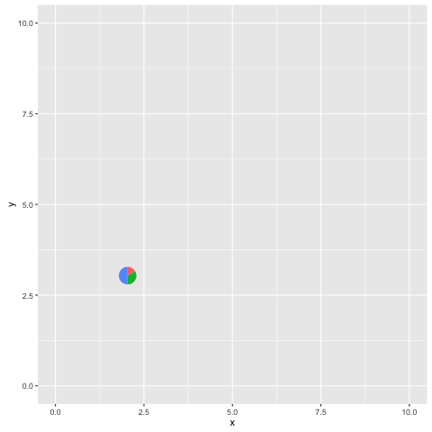

```{r style, echo=FALSE, results="asis", message=FALSE}
knitr::opts_chunk$set(tidy = FALSE,
		   message = FALSE)
```


```{r echo=FALSE, results="hide", message=FALSE}
library("ape")
library("ggplot2")
library("ggtree")
```


# Layers that allows subsetting

`Subsetting` is not supported in layers defined in `ggplot2`, while it is quite useful in phylogenetic annotation since it allows us to annotate at specific node(s). 

In `ggtree`, we provides modified version of layers defined in `ggplot2` to support `subsetting`, including:

+ geom_segment2
+ geom_point2
+ geom_text2
+ geom_label2

```{r fig.width=5, fig.height=5}
file <- system.file("extdata/BEAST", "beast_mcc.tree", package="ggtree")
beast <- read.beast(file)
ggtree(beast) + geom_point2(aes(subset=!is.na(posterior) & posterior > 0.75), color='firebrick')
```

# Multiple graphs on one page

To support viewing multiple plots, ggtree provides `multiplot` function that similar to `gridExtra::grid.arrange` with extra feature of labeling the plots.


```{r fig.width=8, fig.height=4, warning=FALSE}
multiplot(ggtree(rtree(30)), ggtree(rtree(40)), ncol=2, labels=c('A', 'B'))
```


# subplots in ggplot object

`ggtree` implemented a function, `subview`, that can add subplots on a ggplot2 object. 

```{r fig.width=8, fig.height=8, warning=F}
set.seed(2016-01-04)
tr <- rtree(30)
tr <- groupClade(tr, node=45)
p <- ggtree(tr, aes(color=group)) + geom_tippoint()
p1 <- p + geom_hilight(node=45)
p2 <- viewClade(p, node=45) + geom_tiplab()
subview(p2, p1+theme_transparent(), x=2.3, y=28.5)
```

This is the backend of the [inset](advanceTreeAnnotation.html) function.

This `subview` function works with any `ggplot` objects and it had successful applied to [plot pie graphs on map](http://stackoverflow.com/questions/10368180/plotting-pie-graphs-on-map-in-ggplot/32380396#32380396).

```{r eval=FALSE}
library(ggtree)
dd <- data.frame(x=LETTERS[1:3], y=1:3)
pie <- ggplot(dd, aes(x=1, y, fill=x)) + geom_bar(stat="identity", width=1) + coord_polar(theta="y") + theme_inset()
x <- sample(2:9)
y <- sample(2:9)
width <- sample(seq(0.05, 0.15, length.out=length(x)))
height <- width
p <- ggplot(data=data.frame(x=c(0, 10), y=c(0, 10)), aes(x, y))+geom_blank()
for (i in seq_along(x)) {
    p <- subview(p, pie, x[i], y[i], width[i], height[i])
    print(p)
}
```



