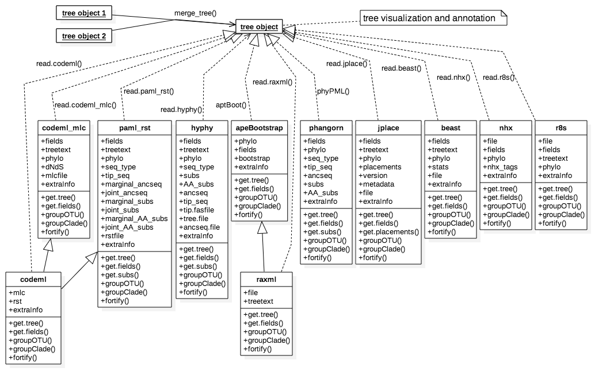

```{r style, echo=FALSE, results="asis", message=FALSE}
BiocStyle::markdown()
knitr::opts_chunk$set(tidy = FALSE,
		   message = FALSE)
```


```{r echo=FALSE, results="hide", message=FALSE}
library("ape")
library("ggplot2")
library("ggtree")
```


The `r Githubpkg("GuangchuangYu/ggtree")` package should not be viewed solely as a standalone software. While it is useful for viewing, annotating and manipulating phylogenetic trees, it is also an infrastructure that enables evolutionary evidences that inferred by commonly used software packages in the field to be used in `R`. For instance, *dN/dS* values or ancestral sequences inferred by [CODEML](http://abacus.gene.ucl.ac.uk/software/paml.html)[@yang_paml_2007], *clade support values (posterior)* inferred by [BEAST](http://beast2.org/)[@bouckaert_beast_2014] and short read placement by [EPA](http://sco.h-its.org/exelixis/web/software/epa/index.html)[@berger_EPA_2011] and [pplacer](http://matsen.fhcrc.org/pplacer/)[@matsen_pplacer_2010]. These evolutionary evidences are not only used in annotating phylogenetic tree in  `r Githubpkg("GuangchuangYu/ggtree")` but can also be further analyzed in `R`.

# Supported File Formats

Most of the tree viewer software (including `R` packages) focus on `Newick` and `Nexus` file format, while there are file formats from different evolution analysis software that contain supporting evidences within the file that are ready for annotating a phylogenetic tree.
The `r Githubpkg("GuangchuangYu/ggtree")` package define several parser functions and `S4` classes to store statistical evidences inferred by commonly used software packages. It supports several file format, including:

+ Newick (via `ape`)
+ Nexus (via `ape`)
+ New Hampshire eXtended format (NHX)
+ Jplace

and software output from:

+ [BEAST](http://beast2.org/)[@bouckaert_beast_2014] 
+ [EPA](http://sco.h-its.org/exelixis/web/software/epa/index.html)[@berger_EPA_2011]
+ [HYPHY](http://hyphy.org/w/index.php/Main_Page)[@pond_hyphy_2005]
+ [PAML](http://abacus.gene.ucl.ac.uk/software/paml.html)[@yang_paml_2007]
+ [PHYLDOG](http://pbil.univ-lyon1.fr/software/phyldog/)[@boussau_genome-scale_2013]
+ [pplacer](http://matsen.fhcrc.org/pplacer/)[@matsen_pplacer_2010]
+ [r8s](http://loco.biosci.arizona.edu/r8s/)[@marazzi_locating_2012]
+ [RAxML](http://sco.h-its.org/exelixis/web/software/raxml/)[@stamatakis_raxml_2014]
+ [RevBayes](http://revbayes.github.io/intro.html)[@hohna_probabilistic_2014]

# Parser functions

The `r Githubpkg("GuangchuangYu/ggtree")` package implement several parser functions, including:

+ `read.beast` for parsing output of [BEASE](http://beast2.org/)
+ `read.codeml` for parsing output of [CODEML](http://abacus.gene.ucl.ac.uk/software/paml.html) (`rst` and `mlc` files)
+ `read.codeml_mlc` for parsing `mlc` file (output of `CODEML`)
+ `read.hyphy` for parsing output of [HYPHY](http://hyphy.org/w/index.php/Main_Page)
+ `read.jplace` for parsing `jplace` file including output from [EPA](http://sco.h-its.org/exelixis/web/software/epa/index.html) and [pplacer](http://matsen.fhcrc.org/pplacer/)
+ `read.nhx` for parsing `NHX` file including output from [PHYLODOG](http://pbil.univ-lyon1.fr/software/phyldog/) and RevBayes](http://revbayes.github.io/intro.html)
+ `read.paml_rst` for parsing `rst` file (output of `BASEML` and `CODEML`)
+ `read.r8s` for parsing output of [r8s](loco.biosci.arizona.edu/r8s/)
+ `read.raxml` for parsing output of [RAxML](http://sco.h-its.org/exelixis/web/software/raxml/)

# S4 classes

Correspondingly, `r Githubpkg("GuangchuangYu/ggtree")` define several `S4` classes to store evolutionary evidences inferred by these software packages, including:

+ _`apeBootstrap`_ for bootstrap analysis of `ape::boot.phylo()`[@paradis_ape_2004], output of `apeBoot()` defined in `ggtree`
+ _`beast`_ for storing output of `read.beast()`
+ _`codeml`_ for storing output of `read.codeml()`
+ _`codeml_mlc`_ for storing output of `read.codeml_mlc()`
+ _`hyphy`_ for storing output of `read.hyphy()`
+ _`jplace`_ for storing output of `read.jplace()`
+ _`nhx`_ for storing output of `read.nhx()`
+ _`paml_rst`_ for _`rst`_ file obtained by [PAML], including _`BASEML`_ and _`CODEML`_.
+ _`phangorn`_ for storing ancestral sequences inferred by `R` package `phangorn`[@schliep_phangorn_2011], output of `phyPML()` defined in `ggtree`
+ _`r8s`_ for storing output of `read.r8s()`
+ _`raxml`_ for storing output of `read.raxml()`


The _`jplace`_ class is also designed to store user specific annotation data, and serves as a standard format for tree annotation within the `r Githubpkg("GuangchuangYu/ggtree")` package. 


Here is an overview of these `S4` classes:



In addition, `ggtree` also supports _`phylo`_ (defined by `r CRANpkg("ape")`[@paradis_ape_2004]) and _`phylo4`_ (defined by `r CRANpkg("phylobase")`).


In `ggtree`, tree objects can be merged and evidences inferred from different phylogenetic analyses can be combined or compared and visualized.

Viewing a phylogenetic tree in `ggtree` is easy by using the command `ggtree(tree_object)` and annotating a phylogenetic tree is simple by adding graphic layers using the grammar of graphics.


For each class, we defined _`get.fields`_ method to get the annotation features that available in the object that can be used to annotate a phylogenetic tree directly in `ggtree`. A _`get.tree`_ method can be used to convert tree object to `phylo` object that are widely supported by other `R` packages. 

The _`groupOTU`_ method is used for clustering related OTUs (from tips to their most recent common ancestor). Related OTUs are not necessarily within a clade, they can be distantly related. _`groupOTU`_ works fine for monophyletic (clade), polyphyletic and paraphyletic, while _`groupClade`_ only works for clade (monophyletic). These methods are useful for clustering related OTUs or clades.

The _`fortify`_ method is used to convert tree object to a `data.frame` which is familiar by `R` users and easy to manipulate. The output `data.frame` contains tree information and all evolutionary evidences (if available, e.g. _*dN/dS*_ in `codeml` object).

# Getting Tree Data into R

## Parsing BEAST output

```{r}
file <- system.file("extdata/BEAST", "beast_mcc.tree", package="ggtree")
beast <- read.beast(file)
beast
```

Since _`%`_ is not a valid character in _`names`_, all the feature names that contain _`x%`_ will convert to _`0.x`_. For example, _`length_95%_HPD`_ will be changed to _`length_0.95_HPD`_.

The _`get.fields`_ method return all available features that can be used for annotation.
```{r}
get.fields(beast)
```

Users can use `ggtree(beast)` to visualize the tree and add layer to annotate it.

```{r warning=FALSE}
ggtree(beast, ndigits=2, branch.length = 'none') + geom_text(aes(x=branch, label=length_0.95_HPD), vjust=-.5, color='firebrick')
```

With `ggtree`, evolutionary evidences inferred by commonly used software packages (`BEAST` in this example) can be easily obtained in a tidy `data.frame` by `fortify` method.

```{r}
beast_data <- fortify(beast)
head(beast_data)
```

## Parsing PAML output

### _`rst`_ file

The _`read.paml_rst`_ function can parse `rst` file from `BASEML` and `CODEML`. The only difference is the space in the sequences. For `BASEML`, each ten bases are separated by one space, while for `CODEML`, each three bases (triplet) are separated by one space.

```{r fig.width=8, width=60, warning=FALSE, fig.align="center"}
brstfile <- system.file("extdata/PAML_Baseml", "rst", package="ggtree")
brst <- read.paml_rst(brstfile)
brst
p <- ggtree(brst) +
    geom_text(aes(x=branch, label=marginal_AA_subs), vjust=-.5, color='steelblue') +
    theme_tree2()
print(p)
```

Similarly, we can parse the `rst` file from `CODEML` and visualize the tree with amino acid substitution.
```{r}
crstfile <- system.file("extdata/PAML_Codeml", "rst", package="ggtree")
crst <- read.paml_rst(crstfile)
crst
```


In `ggtree`, we define the `update` operator, `%<%`, that can update a tree view (applying the same pattern of visualization and annotation) with another tree object.

```{r fig.width=8, width=60, warning=FALSE, fig.align="center"}
p %<% crst
```

We can find that these two figures have different evolution distances and subsitutions inferred by `BASEML` and `CODEML` are slightly different.

### CODEML

#### mlc file

The `mlc` file output by `CODEML` contains _`dN/dS`_ estimation.


```{r}
mlcfile <- system.file("extdata/PAML_Codeml", "mlc", package="ggtree")
mlc <- read.codeml_mlc(mlcfile)
mlc
```

Please aware that _`/`_ and _`*`_ are not valid characters in _`names`_, they were changed to _`_vs_`_ and _`_x_`_ respectively.

So _`dN_vs_dS`_ is _`dN/dS`_, _`N_x_dN`_ is _`N*dN`_, and _`S_x_dS`_ is _`S*dS`_.


```{r fig.width=8, width=60, warning=FALSE, fig.align="center"}
ggtree(mlc) + geom_text(aes(x=branch, label=dN_vs_dS), color='blue', vjust=-.2)
```

The paramter _`branch.length`_ can be one of available annotations:
```{r}
get.fields(mlc)
```

For example, if we set _`branch.length`_ to _`dN_vs_dS`_, the tree view will be re-scaled based on $\omega$ (_`dN/dS`_).

```{r fig.width=8, width=60, warning=FALSE, fig.align="center"}
ggtree(mlc, branch.length = "dN_vs_dS", aes(color=dN_vs_dS)) +
    scale_color_continuous(name='dN/dS', limits=c(0, 1.5),
                           oob=scales::squish, low="darkgreen", high="red")+
    theme_tree2(legend.position=c(.9, .5))
```

We can also plot the _`dN`_ or _`dS`_ tree and others. 

#### rst and mlc files


#### _`CODEML`_ output: rst and mlc files\


We annotate the tree with information presented in _`rst`_ and _`mlc`_ file separately as demonstrated in previous sessions.

We can also use both of them which is highly recommended. 


```{r}
ml <- read.codeml(crstfile, mlcfile)
ml
head(fortify(ml))
```

All the features in both files are available for annotation. For example, we can annotate _`dN/dS`_ with the tree in _`rstfile`_ and amino acid substitutions with the tree in _`mlcfile`_.


## Parsing NHX tree

NHX (New Hampshire eXtended) format is commonly used in phylogenetics software (e.g. [PHYLDOG](http://pbil.univ-lyon1.fr/software/phyldog/)[@boussau_genome-scale_2013], [RevBayes](http://revbayes.github.io/intro.html)[@hohna_probabilistic_2014], *etc*.)

```{r}
nhxfile <- system.file("extdata", "ADH.nhx", package="ggtree")
nhx <- read.nhx(nhxfile)
ggtree(nhx) + geom_tiplab() + geom_point(aes(color=S), size=5, alpha=.5) + 
    theme(legend.position="right") +
    geom_text(aes(label=branch.length, x=branch), vjust=-.5) + 
    xlim(NA, 0.3)
```


# References

