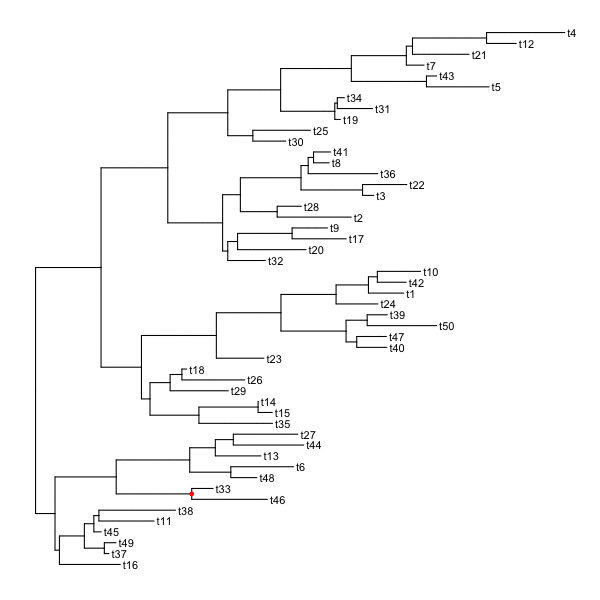
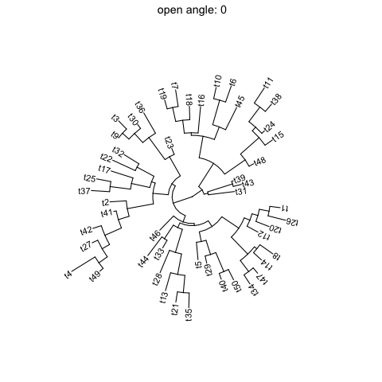

```{r style, echo=FALSE, results="asis", message=FALSE}
knitr::opts_chunk$set(tidy = FALSE,
		   message = FALSE)
```


```{r echo=FALSE, results="hide", message=FALSE}
library("ape")
library("ggplot2")
library("ggtree")
collapse <- ggtree::collapse
expand <- ggtree::expand
rotate <- ggtree::rotate
flip <- ggtree::flip
MRCA <- ggtree::MRCA
```

# Internal node number

Some of the functions in `ggtree` work with clade and accept a parameter of internal node number. To get the internal node number, user can use `geom_text2` to display it:

```{r}
nwk <- system.file("extdata", "sample.nwk", package="ggtree")
tree <- read.tree(nwk)
ggtree(tree) + geom_text2(aes(subset=!isTip, label=node), hjust=-.3) + geom_tiplab()
```

Another way to get the internal node number is using `MRCA()` function by providing a vector of taxa names. The function will return node number of input taxa's most recent commond ancestor (MRCA). It works with tree and graphic object.


```{r}
MRCA(tree, tip=c('A', 'E'))
MRCA(tree, tip=c('H', 'G'))

p <- ggtree(tree)
MRCA(p, tip=c('A', 'E'))
```

# view Clade

`ggtree` provides a function `viewClade` to visualize a clade of a phylogenetic tree.

```{r fig.width=5, fig.height=5, fig.align="center", warning=FALSE}
viewClade(p+geom_tiplab(), node=21)
```


# group Clades

The `ggtree` package defined several functions to manipulate tree view. _`groupClade`_ and _`groupOTU`_ methods were designed for clustering clades or related OTUs. _`groupClade`_ accepts an internal node or a vector of internal nodes to cluster clade/clades.

Both _`groupClade`_ and _`groupOTU`_ work fine with tree and graphic object.

```{r fig.width=5, fig.height=5, fig.align="center", warning=FALSE}
tree <- groupClade(tree, node=21)
ggtree(tree, aes(color=group, linetype=group))
```

The following command will produce the same figure.

```{r eval=FALSE}
ggtree(read.tree(nwk)) %>% groupClade(node=21) + aes(color=group, linetype=group)
```


With `groupClade` and `groupOTU`, it's easy to highlight selected taxa and easy to select taxa to display related features.

```{r fig.width=5, fig.height=5, fig.align="center", warning=FALSE}
tree <- groupClade(tree, node=c(21, 17))
ggtree(tree, aes(color=group, linetype=group)) + geom_tiplab(aes(subset=(group==2)))
```


# group OTUs
_`groupOTU`_ accepts a vector of OTUs (taxa name) or a list of OTUs.  _`groupOTU`_ will trace back from OTUs to their most recent common ancestor and cluster them together. Related OTUs are not necessarily within a clade, they can be monophyletic (clade), polyphyletic or paraphyletic.


```{r}
tree <- groupOTU(tree, focus=c("D", "E", "F", "G"))
```

```{r fig.width=5, fig.height=5, fig.align="center", warning=FALSE}
ggtree(tree, aes(color=group)) + geom_tiplab()
```

_`groupOTU`_ can also input a list of tip groups.

```{r fig.width=5, fig.height=5, fig.align="center", warning=FALSE}
cls <- list(c1=c("A", "B", "C", "D", "E"),
            c2=c("F", "G", "H"),
            c3=c("L", "K", "I", "J"),
            c4="M")

tree <- groupOTU(tree, cls)
library("colorspace")
ggtree(tree, aes(color=group, linetype=group)) + geom_tiplab() +
     scale_color_manual(values=c("black", rainbow_hcl(4))) + theme(legend.position="right")
```


_`groupOTU`_ also work with graphic object.

```{r fig.width=5, fig.height=5, fig.align="center", warning=FALSE}
p <- ggtree(tree)
groupOTU(p, LETTERS[1:5]) + aes(color=group) + geom_tiplab() + scale_color_manual(values=c("black", "firebrick"))
```

The following example use `groupOTU` to display taxa classification.

```{r fig.width=14, fig.height=14}
library("ape")
data(chiroptera)
groupInfo <- split(chiroptera$tip.label, gsub("_\\w+", "", chiroptera$tip.label))
chiroptera <- groupOTU(chiroptera, groupInfo)
ggtree(chiroptera, aes(color=group), layout='circular') + geom_tiplab(size=1, aes(angle=angle))
```

<!--
## iris example

In this example, we first build a tree based on the iris data, then grouping the tree based on different spacies.

```{r fig.width=20, fig.height=20, fig.align="center", warning=FALSE}
data(iris)
rn <- paste0(iris[,5], "_", 1:150)
rownames(iris) <- rn
d_iris <- dist(iris[,-5], method="man")

tree_iris <- bionj(d_iris)
tree_iris <- groupOTU(tree_iris, list(setosa        = rn[1:50],
                                      versicolor    = rn[51:100],
                                      virginica_145 = rn[101:150]))
cols <- rainbow_hcl(4)
ggtree(tree_iris, aes(color=group)) +
    geom_text(aes(label=label), hjust=-.1) +
    scale_color_manual(values=cols, breaks=1:3,
                       labels=c("Setosa", "Versicolor", "Virginica")) +
    theme(legend.position="right")
```		
-->
	


# collapse clade

With _`collapse`_ function, user can collapse a selected clade.

```{r fig.width=5, fig.height=5, fig.align="center", warning=FALSE}
cp <- ggtree(tree) %>% collapse(node=21)
cp + geom_point2(aes(subset=(node == 21)), size=5, shape=23, fill="steelblue")
```

# expand collapsed clade

The collapsed clade can be expanded via _`expand`_ function.

```{r fig.width=5, fig.height=5, fig.align="center", warning=FALSE}
cp %>% expand(node=21)
```

```{r fig.width=15, fig.height=3, warning=FALSE}
p1 <- ggtree(tree)
p2 <- collapse(p1, 21) + geom_point2(aes(subset=(node==21)), size=5, shape=23, fill="blue")
p3 <- collapse(p2, 17) + geom_point2(aes(subset=(node==17)), size=5, shape=23, fill="red")
p4 <- expand(p3, 17)
p5 <- expand(p4, 21)

multiplot(p1, p2, p3, p4, p5, ncol=5)
```

# scale clade


Collpase selected clades can save some space, another approach is to zoom out clade to a small scale.

```{r fig.width=12, fig.height=6, warning=F}
multiplot(ggtree(tree) + geom_hilight(21, "steelblue"),
          ggtree(tree) %>% scaleClade(21, scale=0.3) + geom_hilight(21, "steelblue"),
          ncol=2)
```

Of course, _`scaleClade`_ can accept `scale` larger than 1 and zoom in the selected portion.

```{r fig.width=12, fig.height=6, warning=F}
multiplot(ggtree(tree) + geom_hilight(17, fill="steelblue") +
                 geom_hilight(21, fill="darkgreen"),
          ggtree(tree) %>% scaleClade(17, scale=2) %>% scaleClade(21, scale=0.3) +
                 geom_hilight(17, "steelblue") + geom_hilight(21, fill="darkgreen"),
          ncol=2)
```

# rotate clade

A selected clade can be rotated by 180 degree using __`rotate`__ function.


```{r fig.width=8, fig.height=4}
tree <- groupClade(tree, c(21, 17))
p <- ggtree(tree, aes(color=group)) + scale_color_manual(values=c("black", "firebrick", "steelblue"))
p2 <- rotate(p, 21) %>% rotate(17)
multiplot(p, p2, ncol=2)
```

```{r eval=F}
set.seed(2016-05-29)
p <- ggtree(tree <- rtree(50)) + geom_tiplab()
for (n in reorder(tree, 'postorder')$edge[,1] %>% unique) {
    p <- rotate(p, n)
    print(p + geom_point2(aes(subset = (node == n)), color='red'))
}
```




# flip clade

The positions of two selected clades (should share a same parent) can be flip over using __`flip`__ function.

```{r fig.width=8, fig.height=4}
multiplot(p, flip(p, 17, 21), ncol=2)
```


# open tree

`ggtree` supports `fan` layout and can also transform the `circular` layout tree to a `fan` tree by specifying an open `angle` to `open_tree` function.

```{r eval=FALSE}
set.seed(123)
tr = rtree(50)

p <- ggtree(tr, layout='circular') + geom_tiplab2()

for (angle in seq(0, 270, 10)) {
    print(open_tree(p, angle=angle) + ggtitle(paste("open angle:", angle)))
}
```




# rotate tree

Rotating a `circular` tree is supported by `rotate_tree` function.

```{r eval=FALSE}
for (angle in seq(0, 270, 10)) {
    print(rotate_tree(p, angle) + ggtitle(paste("rotate angle:", angle)))
}
```


